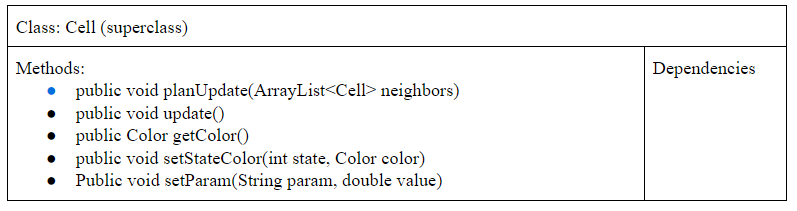

# Simulation Design Plan
### Team Number 11
### Names: Maverick Chung, Alex Oesterling, Alex Xu

## Introduction
The main problem we are trying to solve is how to create a simulation program that is flexible enough to take different configurations of cells, as well as different rules for different types of simulations (game of life, percolation, fire, etc).
Design goals of the project include making the initial configuration of cells and rules flexible, allowing for changes to the how the visualizer displays the simulation (flexibility in customizing the appearance), and flexibility in changing simulation parameters, such as the speed of updating the simulation. From a backend perspective, design goals of this project are for the type of cell and simulation to be swappable via new configuration files. In addition, another design goal is that the data structures used can be changed if new information or requirements arise later along in the project timeline. Finally, if a component of one “area” of the project (Configuration, Simulation, Visualization) needs to be changed, its modification should not affect the functionality of another component.

To achieve these goals, we decided that it would make the most sense to separate the program into different classes that are responsible for different aspects of the simulation. Thus, the specific implementation of another aspect of the program (e.g. how individual cells update) does not affect the functioning of the rest of the program (e.g. how the cells are displayed in the GUI) without major changes (this is closed).

Furthermore, certain information will be public/open between the different parts of the program, while others will be private/closed. For example, the cell module will have an abstract Cell class which is extended by the different cells used in each different simulation. This means if another simulation is added, all that it takes to adopt is creating a new cell class with rules corresponding to this new simulation. Our other classes would not benefit from abstraction because they all serve one purpose and do not have a requirement for significant flexibility dictating an abstraction; creating an abstract Main class which can be extended by one main which can handle user mouse clicks to update the status of the cells and one which randomly changes the status of the cells seems to be less useful than just adding additional methods such as “handleMouse()” into the singular main method. Another way we can close our methods is by making the configuration class create the grid, instead of taking the XML data, passing it into main, and then having the main class use that data to create the grid and cells. If the configuration class handles creating the grid and cells, then the information processed by the XML data stays within the configuration class and so any changes to the XML format and processing do not affect the code written in the main class and grid class.

In terms of public and private information, the visualization aspect of the program would not need to know how many cells are neighbors to a certain cell; that information would be closed to the visualizer. Another example is that each individual cell in the grid would not need to know whether or not it is in a full neighborhood of other cells, or a half-neighborhood. That information would be closed to the grid only. On the other hand, an example of information that would be open would be the state of a cell. Each cell would need to check the state of some other cells before updating. Thus this information would need to be open and publically available to these other parts of the program, and not just private to each individual cell.

## Overview

We will have four different classes for this project. A visualization class will be our main class, and it will take information regarding color from the Grid class (locations of where to put certain colors). The visualization class is responsible for GUI, user inputs into the GUI, and drawing out the simulation. 

The Grid class will hold the data structure that represents the grid of cells for the program. The specific implementation of what type of data structure will be flexible, and other parts of the program/other classes would not depend on the implementation of a specific data structure. 

The Cell class represents a single cell in the grid, and holds information regarding that particular cell (i.e. state, color, previous state, current state). It is also responsible for updating information regarding itself.

Finally, a configuration class is responsible for loading and reading from a text file.

First, configuration class is used to create the initial configuration of cells and define what simulation the program will run. The configuration class will load a file the user has specified by interacting with the GUI created in the main class. The main class then runs the simulation (when the user specifies it to do so, by clicking a button). To step through the simulation, the main class calls stepGrid(). update() is then called in the Grid class, which calls planUpdate() and then update(). This updates the cells. The main class/visualizer now requires locations and colors to draw. getColorGrid() returns this information, and the visualization redraws the next frame.

Please see CRC Cards Below for more information regarding these classes.





**2 Different Implementations (for communicating color to the Main):**

Our chosen implementation for the data structure representing the grid of cells is an ArrayList. However, other implementations such as a 2D array, other types of lists, or Map could also work as well. One of our aims in designing our code is to make other classes/methods implementation agnostic. This means that regardless of what data structure we use here, it would not require changing the implementation of other classes. For example, for the visualizer/main class to work, it takes a 2D array of Color objects from the getColorGrid() method in the Grid class. So, if the internal implementation of the Grid class changes, as long as getColorGrid() has the same return type (which it will), the signature will not change and no changes are needed in the visualizer/main class. In addition, our usage of ArrayLists can be generalized to Lists. So, by using Lists for the signature in the methods in the Grid Class, other types of lists can be implemented without even changing the signature of these other methods.

Finally, we have considered alternatives that perhaps could increase the flexibility of our code in handling different implementations of the grid data structure. One alternative to assemble the 2D array of Color objects in the main/visualizer class instead of doing it in the Grid class. This way, only the signature of a cell is required for that method, which does not change (as Cells are objects that we define ourselves).

## User Interface

The user interface of this program will allow a user to control the parameters dictating the processing, updating, and development of the cell simulation. The primary portion of the GUI will be a visual displaying the simulation. This will consist of colored squares (possibly ImageView nodes) arranged in an NxM rectangle as specified by the imported simulation specifications. The user can interact with the simulation through a set of buttons, sliders and menus. There will be a button which allows the user to pause and resume the simulation. In addition, there will be a slider scale, possibly labeled “slow...normal…fast” which allows the user to change the speed at which the simulation runs. Finally, there should be an option to load a new configuration file. One option we were thinking of was creating a dropdown menu which contained options such as “load file,” “reset simulation,” and “quit.” The load file option would open up a file navigator prompt allowing the user to navigate and select an .xml file. The reset simulation prompt would allow the user to restart the simulation from the initial configuration set by the .xml file, and finally, quit would exit the application. If the user imports a file that is not an .xml file or an .xml file in the incorrect configuration, an error dialog box will pop up saying “error: bad file type,” and the game will revert or continue with the most recently uploaded valid configuration.

**User Interface Design Mockup:**


## Design Details

Our design will contain the four classes as specified in the Overview section above:

* Visualization (main) Class: This class runs the graphics and user interface portion of the simulation. The main class will take an XML file (loaded in the configuration class), create a scene and stage, and place the colors representing the cells, along with any user interface buttons, sliders, and menus into the scene. To load an XML file, this class will create an instance of the configuration class and use it to read data from the XML file and create the subsequent cells and grid, which it returns to the Main class. Then, the Main class will have a method to get the color data of each cell from the Grid class and use it to render the simulation scene. Finally, it will add the external buttons, sliders, and menus that the user uses to alter the settings of the game. This class will have a game loop method which it uses to run the simulation and update it over time, checking user inputs and updating the graphics. This class fulfills the requirements of allowing a user to change parameters such as speed, play/pause, and reset simulation because it has a GUI for rendering and handling user input.
* Configuration Class: The Configuration class reads the XML fill passed by the Main class and creates the necessary objects in the correct orientations and states. This will most likely have a method which reads the XML file and creates Cell objects based on the data specified by the XML file. It will have an instance variable Grid class which it places the Cells into and then returns this Grid for the Main class to access and use itself. This class fulfills the requirements of allowing a user to load a simulation from an XML file by handling XML data and converting it into Grid and Cell objects. 
* Grid Class: This class serves as a container for all the cell data. It will have an instance variable data structure containing all of the Cells, and it will have an update() method (called in the Main class) which it uses to check the states of all the cells, and then update the states of all the cells. The grid will be created by the Configuration class which the configuration class runs, so that the accessing of XML data is closed to the configuration class and is immediately transformed into the live grid structure. The grid class will also know the location data of the cells, while the cells should not. The Grid’s update method will go through all the Cells, passing in its neighbors and asking them to plan their next state, and then will loop through again, actually updating each cell (to prevent a new state from affecting the computations of cells still on the old state.) This class handles the requirement of the cells not keeping track of their position and just neighbor data, as well as the fact that cells only update after each checks the status of their future state.
* Cell Class: This class will track the states of each individual Cell object, and update them when called by the Grid class. In addition, the Cell class will be abstract, with specific types of extending cells each having different rules hardcoded into them which depend on the “ruleset” or “simulation type” specified in the XML config document. This handles the specification that the simulation app must be able to run at least 4 different simulations. Furthermore, the rules data contained within the Cell allow them to update based on different simulation scenarios. The Cell class will have a “planUpdate()” method which takes in a list of its neighbors and uses this data to plan its next state, and then an “update()” method where the cell actually switches its state to the “next” state. The Cell class will also have color data which it calculates based on its state, and is passed back through the Grid class to the Main class for rendering.

## Design Considerations

We talked at length about where the various data should live such that the code is sufficiently compartmentalized, with each section of the code handling its own responsibilities and as few dependencies as possible.

One such case of this was where we wanted to hold the rules for the game. We considered having Grid be a superclass, with its subclasses holding the rules for the various types of simulation. However, we decided on Cell being this superclass, as the grid should just hold the cells, and the cells are the actors in the environment.

Another case was how the Config class should access the grid to be able to place the correct types of Cell in the correct locations. We initially wanted to have the class access the grid instance variable in main, either through a getter method or by passing the object into the class, but this would create an additional dependency. We decided on having the Config.loadFile() method return a grid object, such that the class did not need to access the instance variable.

Furthermore, we considered was how much to hide the data structure we use to contain our Cell objects. One possible option was to standardize the data we pass into each class, by having the Main class only take in List objects and then have our Grid class do computation under the hood in either data structure type (array or list) and then convert it into a List at the end. However, another possible option which would be a bit more complex but allow for a more closed design would be to have the Grid class return the color type of each cell by index (such as getColor(i, j)), so that all the information it shares is the color data to the Main class without either class needing to pass a data structure.

Moreover, another case we considered was which class would be responsible for determining/storing color information depending on cell states. Options include having the visualizer class map certain states to certain colors, having the Grid class have this map instead which the Grid method getColorGrid() would use, or have individual cells keep track of their color depending on their state. We chose the last option because it made intuitive sense in terms of updating a color depending on the cell’s updated state. In addition, we decided that a user could customize cell colors (colors that represent each state) in the XML file.

#### Components

#### Use Cases

- Apply the rules to a middle cell: set the next state of a cell to dead by counting its number of neighbors using the Game of Life rules for a cell in the middle (i.e., with all its neighbors)
    ```
    //in Grid.update()
    for( every cell in grid){
    ArrayList<Cell> neighbors = getNeighbors(currentCell);
    currentCell.planUpdate(neighbors);
    currentCell.update();
    }
    ```
- Apply the rules to an edge cell: set the next state of a cell to live by counting its number of neighbors using the Game of Life rules for a cell on the edge (i.e., with some of its neighbors missing)
    ```
    //in Grid.update()
    //getNeighbors handles the missing neighbors according to game rules (e.g. considers edge cells to be dead for Conway);
    for( every cell in grid){
    ArrayList<Cell> neighbors = getNeighbors(currentCell);
    currentCell.planUpdate(neighbors);
    currentCell.update();
    }
    ```
- Move to the next generation: update all cells in a simulation from their current state to their next state and display the result graphically
    ```
    //in Main.update()
    stepGrid();
    drawGrid();
    ```
    ```
    //in Main.stepGrid()
    grid.update()
    ```
    ```
    //in Grid.update()
    for( every cell in grid){
    ArrayList<Cell> neighbors = getNeighbors(currentCell);
    currentCell.planUpdate(neighbors);
    currentCell.update();
    }
    ```
    ```
    //in Main.drawGrid()
    Color[][] colors = grid.getColorGrid();
    for(Every color in colors) {
    	drawCell(x, y, color);
    }
    ```
- Set a simulation parameter: set the value of a global configuration parameter, probCatch, for a simulation, Fire, based on the value given in an XML fire
    ```
    //in Config.createGrid()
    Grid grid = new Grid(width, height);
    For (every spot in grid){
    Cell cell = new Cell();
    cell.setParam(“probCatch”, probCatchValue);
    grid.placeCell(x, y, cell);
    }
    ```
- Switch simulations: load a new simulation from an XML file, stopping the current running simulation, Segregation, and starting the newly loaded simulation, Wator
    ```
    //in Main.update()
    Main.setSpeed(0);
    loadConfigFile(“Wator.xml”);
    Main.setSpeed(DEFAULT_SPEED);
    ```

## Team Responsibilities

 * Maverick Chung
    * Primary responsibilities: Cell, Grid
    * Secondary responsibilities: Configuration
 * Alex Oesterling
    * Primary responsibilities: Visualizer
    * Secondary responsibilities: Cell, Grid

 * Alex Xu
    * Primary responsibilities: Configuration
    * Secondary responsibilities: Visualizer

